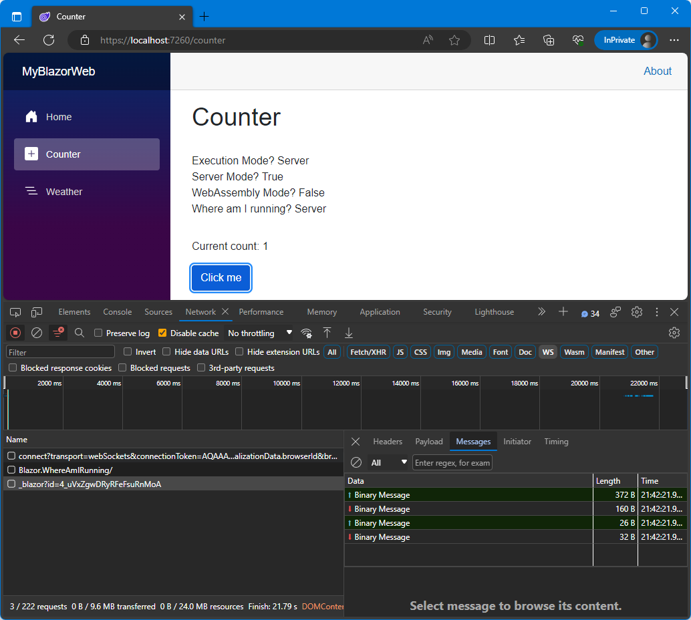

# BLAZOR: Where Am I Running?

This is a simple service for identifying which mode Blazor is running in. Either `Server` or `Wasm`.

The sample project is built with .Net 8.0 RC1 for a Blazor Web App, however the `UtilityService` class in the `Blazor.Utilities`library is multi-targeting and supports versions .Net 6.0+. The `UtilityService` library can also be used for a Blazor Server App or Blazor WebAssembly App.

## How to Use

To use, register the `UtilityService` class with the Dependency Injection system:

```csharp
builder.Services.AddScoped<IUtilityService, UtilityService>();
```

Then inject into a page or component:

```csharp
@inject IUtilityService UtilityService
```

Now we can query using 1 of 3 methods:

```csharp
<div>Execution Mode? @(UtilityService.GetIsServerMode() ? "Server" : "Web Assembly (WASM)")</div>
<div>Server Mode? @(UtilityService.GetIsServerMode()</div>
<div>WebAssembly Mode? @(UtilityService.GetIsWasmMode()</div>
<div>Where am I running?? @(UtilityService.WhereAmIRunning()</div>
```

Below are sample screenshots of the `UtilityService` class in action:

## Static Blazor Page


## RenderModeAuto Page

According to [ASP.NET Core Blazor render modes](https://learn.microsoft.com/en-us/aspnet/core/blazor/components/render-modes?view=aspnetcore-8.0), RenderModeAuto is...
> Interactive client rendering using Blazor Server initially and then WebAssembly on subsequent visits after the Blazor bundle is downloaded

### Running on Server



Above we can see the WebSocket connection `_blazor?id-...` to the server for the Interactivity. The `UtilityService` class shows the Blazor app running in `Server` mode.

### Running on Client (Wasm)


After we refresh the page, and all the WebAssembly files are cached on the client, we ca see the WebSocket connection `_blazor?id-...` is no longer open and now running in the client (Wasm). The `UtilityService` class shows the Blazor app running in `Wasm` mode.

**NOTE:** In the coming .Net 8.0 RC2, it was mentioned in a recent [Microsoft ASP.NET Community Standup](https://www.youtube.com/watch?v=47CZqb53nCM&t=1778s) that the connection should automatically close and switch to Wasm without refreshing the page. How that will work and under what conditions is still to be documented. This project will be updated once .Net 8.0 RC 2 is released.

### Support

If you find this library and sample project useful, then please consider [buying me a coffee ☕](https://bmc.link/gragra33).